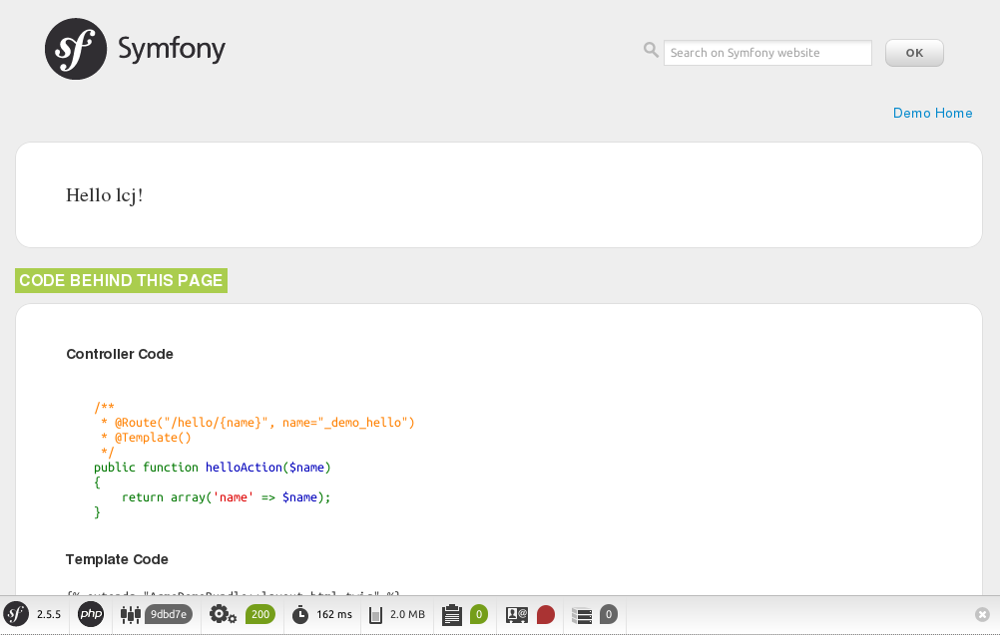

# 创建应用

Symfony2安装已完成，接下来就可以开始进行开发工作了。

首先先对一些术语进行介绍。`Symfony`的每个应用程序都运行在一个环境（`env`）中。在Symfony2中定义了三种环境：`dev`、`test`和`prod`；分别为开发环境、测试环境和生产环境。

Symfony2最终会将程序都编译为PHP代码，存放于 `app/cache` 目录。为了查看效果，程序每次有更改都需要更新 `app/cache` 目录下的缓存。如果在处于`dev`环境或者`test`环境，框架会自动刷新缓存。但是如果是处于`prod`环境，那么就需要每次手动的更新缓存了。

Symfony2中的程序模块名为`Bundle`，它与Django中的`app`类似，，便于代码复用。

接下来运行该程序看下效果。从5.3版本开始PHP就内置了一下简单的http服务器用于开发测试。可以运行如下命令启动服务：

```shell
$ php app/console server:run
Server running on http://127.0.0.1:8000
```

然后在浏览器中访问页面： http://127.0.0.1:8000/app_dev.php/ ，应该可以看到如下图所示的效果。


创建项目时，默认应该也创建了一个示例应用：`AcmeDemoBundle`。在浏览器中访问页面： http://127.0.0.1:8000/app_dev.php/demo/hello/lcj ，应该可以看到如下图所示的效果。



## 创建Bundle
以上是创建项目时自带的一个示例Bundle，现在我们来创建一个自己的Bundle。执行如下命令，然后根据提示一路回车就行了。

```shell
$ php app/console generate:bundle --namespace=Blogger/BlogBundle --format=yml
```

这个类似于Django中的`./manage.py startapp blog`命令。

Bundle创建完成之后会在`src`目录下创建一个`Blogger`目录，目录结构如下：

```
src/Blogger
└── BlogBundle
    ├── BloggerBlogBundle.php
    ├── Controller
    │   └── DefaultController.php
    ├── DependencyInjection
    │   ├── BloggerBlogExtension.php
    │   └── Configuration.php
    ├── Resources
    │   ├── config
    │   ├── doc
    │   ├── public
    │   ├── translations
    │   └── views
    └── Tests
        └── Controller
```

Bundle创建之后需要将其注册才能使用，在上面命令执行完成后应该会自动注册的。如果没有则编辑`app/AppKernel.php`文件，在`registerBundles`方法的`$bundles`数组中添加内容： “`new Blogger\BlogBundle\BloggerBlogBundle(),`”。

Bundle注册完成之后，还需要加载其路由配置，这个应该也是自动完成的。如果没有则编辑`app/config/routing.yml`文件，添加内容：

```yml
blogger_blog:
    resource: "@BloggerBlogBundle/Resources/config/routing.yml"
    prefix:   /
```

现在配置完成了，然后再启动服务。打开页面 http://127.0.0.1:8000/hello/lcj 看看效果。

## 删除Bundle
上面介绍了如何新建一个Bundle，现在再来说说如何删除一个Bundle。以`AcmeDemoBundle`为例，它是在创建项目时自动创建的。它仅仅是一个示例，现在已经不在需要了。

首先将其取消注册。在`AppKernel::registerBundles()`方法中将注册部分的代码删除掉。

然后移除配置信息。将`app/config`中与其相关的配置信息移除掉。对于`AcmeDemoBundle`只需要将`app/config/routing_dev.yml`文件中的路由配置删除即可。

最后再删除Bundle文件。这个直接将 `src/Acme` 目录删除即可。


