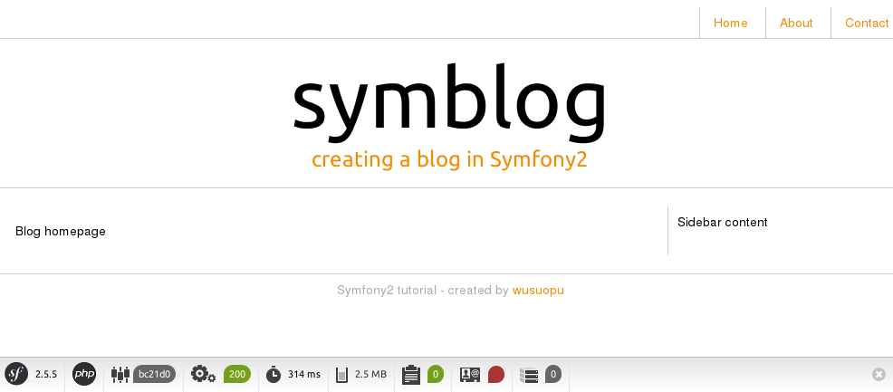

# 创建页面
这一章将介绍如何创建一个简单的页面。首先介绍几点内容。


### 关于路由Routing
`BloggerBlogBundle` 的路由配置位于`src/Blogger/BlogBundle/Resources/config/routing.yml`文件中。它在创建时默认添加了一条记录：

```yml
blogger_blog_homepage:
    path:     /hello/{name}
    defaults: { _controller: BloggerBlogBundle:Default:index }
```

其中`blogger_blog_homepage`为该条路由的名称；
`path`为该条路由的url匹配规则，它可以是一个正则式；`defaults`为该路由指明了对应的控制器。

这里我们的路由是使用yml文件配置的，这个在创建Bundle时可以选择。可选的配置文件格式有：php, xml, yml 和 annotation。为了简便我们约定如下：

* 服务、路由、参数等配置信息一律使用yml格式；
* 数据库的Model实体(Entity)使用annotation格式

### 关于控制器Controller
Bundle在创建时默认创建了一个`DefaultController`，对应的文件为`src/Blogger/BlogBundle/Controller/DefaultController.php`。

路由配置中控制器的设置格式为：`bundle:controller:template`。例如上面的例子中设置为：`BloggerBlogBundle:Default:index`，即表示对应的控制器处理方法为`src/Blogger/BlogBundle/Controller/DefaultController.php`中的`indexAction`，使用的模板为`src/Blogger/BlogBundle/Resources/views/Default/index.html.twig`。

这个算是Symfony框架中的约定。在Symfony框架中有存在一些约定，如：

* 文件名应该与类名一致（这个应该是从JAVA抄来的）；
* 文件分类放在不同目录，如Controller目录只存放控制器，Entity目录存放Model实体等；
* 还有就是文件的命名。控制器文件的命名格式为：`<name>Controller.php`，模板文件的命名为：`<name>.html.twig`，测试用命文件命名以`Test.php`结尾，等等；
* 控制器中对应的处理方法的命名格式为：`<name>Action`，对应的模板文件为：`<name>.html.twig`。

对于这些约定如果之前接触过Rails的话应该不难理解。

### 关于模板View
在Symfony2中提供了 Twig 与 PHP 两种格式的模板，这里我们选用 Twig。

模板文件根据不同控制器存放在`Resources/views/<Controller>`目录中。上面也说过了文件的命名格式为`<name>.html.twig`，如果模板是json内容也可以为`<name>.json.twig`。

Twig模板引擎的语法与Django的模板引擎和Jinja模板引擎非常相似。以下是`index.html.twig`的内容：

```
Hello {{ name }}!
```

## 创建新页面
基本内容已介绍完毕，接下来就创建一个新的页面。由于我们不需要生成器生成的一些文件，可以将其删掉。

删掉`DefaultController`：删除`src/Blogger/BlogBundle/Controller/DefaultController.php`文件和`src/Blogger/BlogBundle/Resources/views/Default`目录，最后移除`src/Blogger/BlogBundle/Resources/config/routing.yml`中的路由配置。

### 创建Controller
现在我们创建一个`PageController`，执行命令：

```shell
$ php app/console generate:controller --controller=BloggerBlogBundle:Page --route-format=yml
```

然后会生成文件：`src/Blogger/BlogBundle/Controller/PageController.php`。

### 创模板布局
由于 Twig 支持模板继承，我们接着使用“三层继承”方法（ http://symfony.com/doc/2.5/book/templating.html#three-level-inheritance ），这个方法让我们可以在应用程序中通过三个独立的层次调整页面。

1.主模板（第1层）
首先创建主模板`app/Resources/views/base.html.twig`，在模板继承中它的名字为：`::base.html.twig`。

2.应用程序模板（第2层）
然后在Bundle中创建应用程序自己的模板`src/Blogger/BlogBundle/Resources/views/layout.html.twig`，在模板继承中它的名字为：`BloggerBlogBundle::layout.html.twig`。

3.页面模板（第3层）
最后根据Controller中的action方法创建页面的模板`src/Blogger/BlogBundle/Resources/views/Page/index.html.twig`，它的名字为：`BloggerBlogBundle:Page:index.html.twig`

### 设置路由
编辑`src/Blogger/BlogBundle/Resources/config/routing.yml`文件，添加路由：

```yml
blogger_blogBundle_homepage:
    pattern:  /
    defaults: { _controller: BloggerBlogBundle:Page:index }
    requirements:
        _method:  GET
```

然后在`PageController`中新建一个`indexAction`方法。

```php
class PageController extends Controller
{
    public function indexAction()
    {
        return $this->render('BloggerBlogBundle:Page:index.html.twig');
    }
}
```

现在浏览器打开页面 http://127.0.0.1:8000/ 看看效果。


