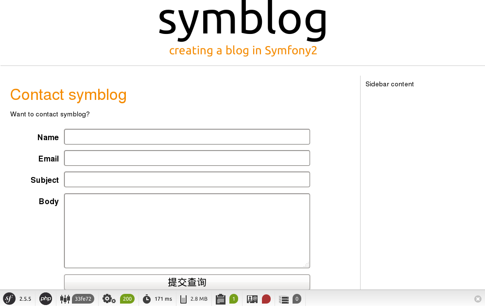
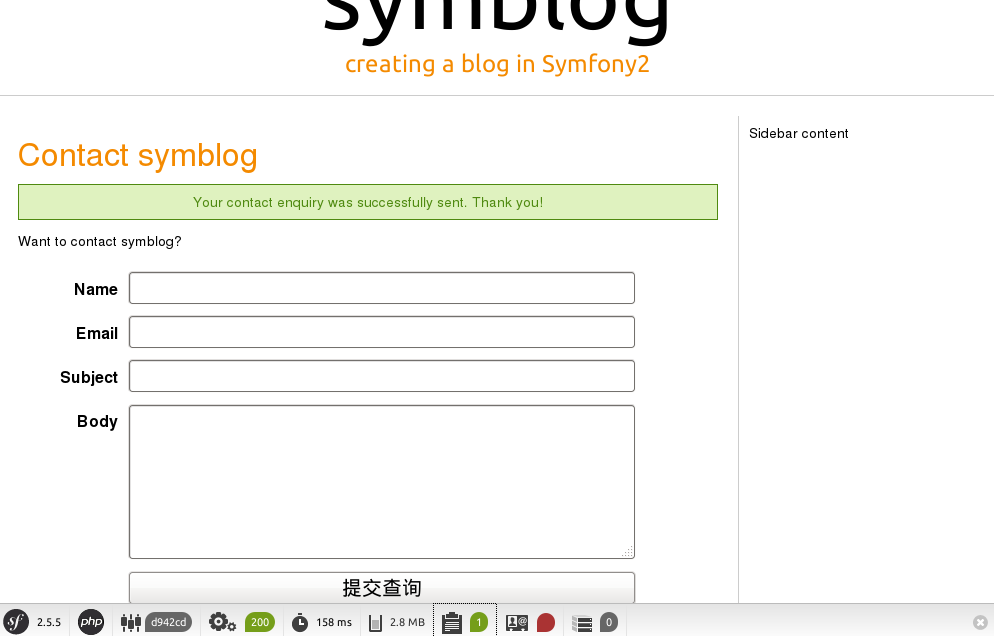

# 表单验证
至此完成了自定义首页，接下来准备做about页面和contact页面。

## About页面
首先添加路由配置：

```yml
blogger_blogBundle_about:
    pattern:  /about
    defaults: { _controller: BloggerBlogBundle:Page:about }
    requirements:
        _method:  GET
```

然后在`PageController`中添加新的Action：

```php
    /**
     * about page.
     *
     * @return array
     *
     * @Template()
     */
    public function aboutAction()
    {
        return array();
    }
```
这部分代码的功能与如下相同：

```php
    public function aboutAction()
    {
        return $this->render('BloggerBlogBundle:Page:about.html.twig');
    }
```

`@Template()`注释信息在这里有作用的，它用于指定使用的模板。参数为空则使用`about.html.twig`。

在前面说过Symfony2的配置可以使用php, xml, yml 和 annotation这四种格式。这里的`@Template()`就是annotation格式的配置。

对于路由配置也可以使用annotation格式：

```php
    /**
     * @Route("/about", name="blogger_blogBundle_about")
     * @Template()
     */
    public function aboutAction()
    {
        return array();
    }
```

annotation的配置方式与`flask`和`bottle`框架的装饰器概念类似。不过为了便于统一管理，按照之前的约定，除了数据库的Model实体(Entity)使用annotation格式外其余的都使用yml格式。

最后再创建模板文件`src/Blogger/BlogBundle/Resources/views/Page/about.html.twig`。

## Contact页面
按照相同方法再创建Contact页面。

```html
{# src/Blogger/BlogBundle/Resources/views/Page/contact.html.twig #}


Contact


    <header>
        <h1>Contact symblog</h1>
    </header>

    <p>Want to contact symblog?</p>

```

最后将这些页面连接起来。最简单的方法就是直接修改连接地址：

```html
<a href="/about">About</a>
<a href="/contact">Contact</a>
```

这样比较简单，但是如果以后这两个页面的路径改变了，那么所有引用了这两个地址的地方都需要修改。正确做法应该是在模板中使用`path`方法生成地址。

```html
<a href="{{ path('blogger_blogBundle_homepage') }}">Home</a>
<a href="{{ path('blogger_blogBundle_about') }}">About</a>
<a href="{{ path('blogger_blogBundle_contact') }}">Contact</a>
```

## 创建表单
现在我们要在Contact页面添加一个表单，以便让用户提交信息。

首先创建一个联系实体用于处理用户提交的内容，新建文件 `src/Blogger/BlogBundle/Entity/Enquiry.php`。

```php
<?php
// src/Blogger/BlogBundle/Entity/Enquiry.php

namespace Blogger\BlogBundle\Entity;

class Enquiry
{
    protected $name;

    protected $email;

    protected $subject;

    protected $body;

    public function getName()
    {
        return $this->name;
    }

    public function setName($name)
    {
        $this->name = $name;
    }

    public function getEmail()
    {
        return $this->email;
    }

    public function setEmail($email)
    {
        $this->email = $email;
    }

    public function getSubject()
    {
        return $this->subject;
    }

    public function setSubject($subject)
    {
        $this->subject = $subject;
    }

    public function getBody()
    {
        return $this->body;
    }

    public function setBody($body)
    {
        $this->body = $body;
    }
}
```

这个类只是定义了一些属性，并没有定义属性的验证或者是属性与表单的关联。关于这个内容下面会说到。

实例类创建完成之后再创建一个表单类，新建文件 `src/Blogger/BlogBundle/Form/EnquiryType.php`。

```php
<?php
// src/Blogger/BlogBundle/Form/EnquiryType.php

namespace Blogger\BlogBundle\Form;

use Symfony\Component\Form\AbstractType;
use Symfony\Component\Form\FormBuilder;

class EnquiryType extends AbstractType
{
    public function buildForm(FormBuilder $builder, array $options)
    {
        $builder->add('name');
        $builder->add('email', 'email');
        $builder->add('subject');
        $builder->add('body', 'textarea');
    }

    public function getName()
    {
        return 'contact';
    }
}
```

这里使用了`FormBuilder`对象来创建表单。

然后就可以在Controller中使用表单了。

```php
    /**
     * about page.
     *
     * @return array
     *
     * @Template()
     */
    public function contactAction()
    {
        $enquiry = new Enquiry();
        $form = $this->createForm(new EnquiryType(), $enquiry);

        $request = $this->get('request');
        if ($request->getMethod() == 'POST') {
            $form->bind($request);

            if ($form->isValid()) {
                // 表单验证通过，执行一些操作，如发送邮件。
                // doSometing();

                return $this->redirect($this->generateUrl('blogger_blogBundle_contact'));
            }
        }

        return array('form' => $form->createView());
    }
```

这里通过`createForm`方法创建一个表单对象，然后再用`bind`方法来接收发送过来的信息并保存到`$enquiry`对象的对应属性上。

最后要显示表单还得修改模板。在`src/Blogger/BlogBundle/Resources/views/Page/contact.html.twig`模板中添加如下内容：

```html
<form action="{{ path('blogger_blogBundle_contact') }}" method="post" {{ form_enctype(form) }} class="blogger">
    {{ form_widget(form) }}

    <input type="submit" />
</form>
```

以上是比较简便的方法，通过`form_widget`将整个表单进行渲染。也可以手动的渲染表单特定字段。内容如下：

```html
    <form action="{{ path('blogger_blogBundle_contact') }}" method="post" {{ form_enctype(form) }} class="blogger">
        {{ form_errors(form) }}

        {{ form_row(form.name) }}
        {{ form_row(form.email) }}
        {{ form_row(form.subject) }}
        {{ form_row(form.body) }}

        {{ form_rest(form) }}

        <input type="submit" />
    </form>
```

为了美观我们再为表单定义一些样式，新建文件`src/Blogger/BlogBundle/Resources/public/css/blog.css`，内容如下：

```css
.blogger-notice { text-align: center; padding: 10px; background: #DFF2BF; border: 1px solid; color: #4F8A10; margin-bottom: 10px; }
form.blogger { font-size: 16px; }
form.blogger div { clear: left; margin-bottom: 10px; }
form.blogger label { float: left; margin-right: 10px; text-align: right; width: 100px; font-weight: bold; vertical-align: top; padding-top: 10px; }
form.blogger input[type="text"],
form.blogger input[type="email"]
    { width: 500px; line-height: 26px; font-size: 20px; min-height: 26px; }
form.blogger textarea { width: 500px; height: 150px; line-height: 26px; font-size: 20px; }
form.blogger input[type="submit"] { margin-left: 110px; width: 508px; line-height: 26px; font-size: 20px; min-height: 26px; }
form.blogger ul li { color: #ff0000; margin-bottom: 5px; }
```

同时别忘了在模板中引用该样式文件：

```html
<link href="{{ asset('bundles/bloggerblog/css/blog.css') }}" type="text/css" rel="stylesheet" />
```

在模板中使用 `asset` 引用资源文件默认是从 `web` 目录下查找。为了能够正常查找到资源文件，需要使用如下命令进行资源收集：

```
$ php app/console assets:install
```

收集的文件存放在 `web/bundles/<namespace><bundle_name>/`目录下。

这个类似于Django中的 `./manager.py collectstatic`。

现在再用浏览器打开 http://127.0.0.1:8000/contact 页面看看效果。




## 表单验证
表单算是是正常显示了，接下来说是对用户提交的数据进行合法性检查。

首先修改路由配置，以便让`/contact`能够接收POST请求。

然后再编写表单验证规则。Symfony2已经为我们提供一些常用的验证器。重新编辑`Enquiry`实体，先导入几个类：

```php
use Symfony\Component\Validator\Mapping\ClassMetadata;
use Symfony\Component\Validator\Constraints\NotBlank;
use Symfony\Component\Validator\Constraints\Email;
use Symfony\Component\Validator\Constraints\Length;
```

再为`Enquiry`类添加`loadValidatorMetadata`方法：

```php
    public static function loadValidatorMetadata(ClassMetadata $metadata)
    {
        $metadata->addPropertyConstraint('name', new NotBlank());
        $metadata->addPropertyConstraint('email', new Email(array('message' => 'invalid email!')));
        $metadata->addPropertyConstraint('subject', new NotBlank());
        $metadata->addPropertyConstraint('subject', new Length(array('max' => 50)));
        $metadata->addPropertyConstraint('body', new Length(array('min' => 10)));

    }
```

现在可以试试随便提交一些不合法的内容，看看错误提示。

## 发送邮件
最后我们还需要在用户提交信息之后给网站站长发送一封邮件。好在Symfony2已经包含了`Swift Mailer`库可以用来完成该功能。

首先编辑`app/config/parameters.yml`文件，找到 `mailer_`开头的参数，设置发送邮件的帐号信息。以下是一个例子：

```yml
mailer_transport="gmail"
mailer_encryption="ssl"
mailer_auth_mode="login"
mailer_host="smtp.gmail.com"
mailer_user="your_username"
mailer_password="your_password"
```

接着再更新Controller：

```php
    if ($form->isValid()) {
        $message = \Swift_Message::newInstance()
            ->setSubject('Contact enquiry from symblog')
            ->setFrom('send account')       // 发件帐号
            ->setTo('receive account')      // 收件帐号
            ->setBody($this->renderView('BloggerBlogBundle:Page:contactEmail.txt.twig', array('enquiry' => $enquiry)));
        $this->get('mailer')->send($message);
        $this->get('session')->getFlashBag()->set('blogger-notice', 'Your contact enquiry was successfully sent. Thank you!');

        return $this->redirect($this->generateUrl('blogger_blogBundle_contact'));
    }
```

然后创建一个邮件模板`src/Blogger/BlogBundle/Resources/views/Page/contactEmail.txt.twig`，内容如下：

```
{# src/Blogger/BlogBundle/Resources/views/Page/contactEmail.txt.twig #}
A contact enquiry was made by {{ enquiry.name }} at {{ "now" | date("Y-m-d H:i") }}.

Reply-To: {{ enquiry.email }}
Subject: {{ enquiry.subject }}
Body:
{{ enquiry.body }}
```

然后在模板中显示`flash`提示信息：

```html
<header>
    <h1>Contact symblog</h1>
</header>


    
        <div class="blogger-notice">
            {{ flashMessage }}
        </div>
    


<p>Want to contact symblog?</p>
```

再次提交表单查看效果：



