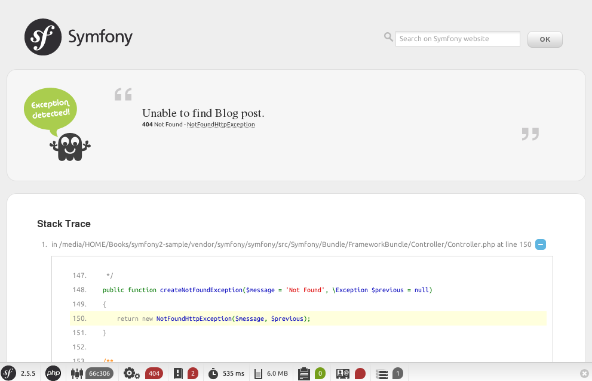
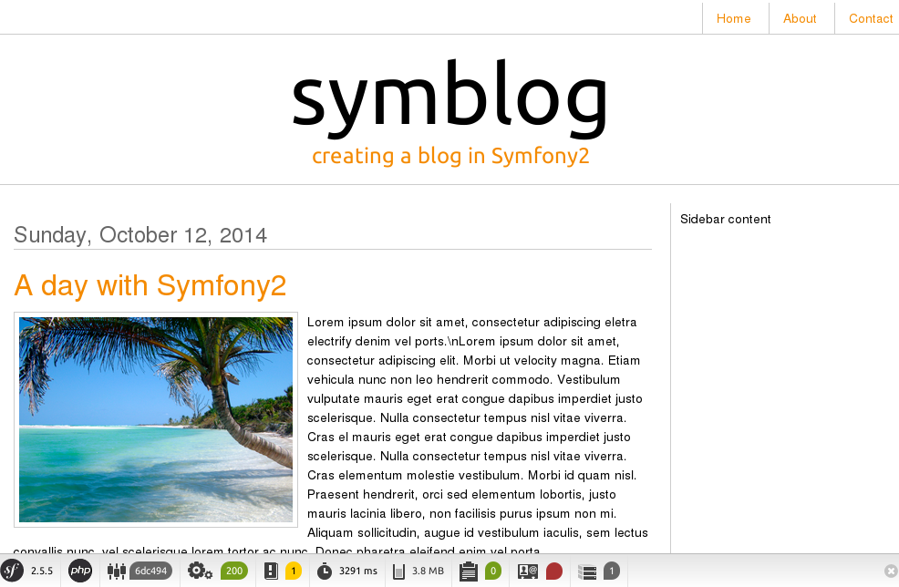

# Doctrine

这一章将介绍Symfony2的数据库操作。在Symfony2中默认使用的ORM库是Doctrine。

## 关于Doctrine
Doctrine是一个专门用于处理数据库操作的ORM库，关于ORM的介绍请参考： http://zh.wikipedia.org/wiki/对象关系映射 。

它基于一个强大的dbal(数据库抽象层) ( http://www.doctrine-project.org/projects/dbal.html ) ，让我们可以透过PHP PDO达到数据存储的抽象化。同时它还提供了一个类似SQL语法的操作，称之为DQL（Doctrine查询语言）。这让我们可以将数据库的数据作为PHP的对象进行操作，而不用关心数据库的细节。这也使得我们可以方便的切换数据库后端引擎。

## 数据库配置
前面有说到过程序总共有`dev`、`test`和`prod`这三种运行环境。为了方便开发测试，我们在开发环境和测试环境中使用SQLite数据库，在生产环境中使用MySQL数据库。

先配置生产环境的数据库。编辑文件`app/config/parameters.yml`找到`database_`开头的参数。根据自己的MySQL信息进行修改。

再配置开发环境的数据库。编辑文件`app/config/config_dev.yml`，添加如下内容：

```yml
doctrine:
    dbal:
        driver:   pdo_sqlite
        path:     "%kernel.root_dir%/data.db3"
        charset:  UTF8

    orm:
        auto_generate_proxy_classes: "%kernel.debug%"
        auto_mapping: true
```

## 创建数据库模型
数据库模型（Model）称之为实体（Entity）。执行如下命令创建一个`User`实体：

```
$ php app/console generate:doctrine:entity --entity=BloggerBlogBundle:User --format=annotation --with-repository --no-interaction --fields="name:string(100) email:string(100)"
```

通过这个命令创建的`User`实体有两个字段：`name`和`email`。这将会生成两个文件：`src/Blogger/BlogBundle/Entity/User.php`和`src/Blogger/BlogBundle/Entity/UserRepository.php`。这个类似于Rails的：

```
$ rails generate scaffold User name:string email:string
```

`User.php`文件内容大致如下：

```php
/**
 * User
 *
 * @ORM\Table(name="user")
 * @ORM\Entity(repositoryClass="Blogger\BlogBundle\Entity\UserRepository")
 */
class User
{
    /**
     * @var integer
     *
     * @ORM\Column(name="id", type="integer")
     * @ORM\Id
     * @ORM\GeneratedValue(strategy="AUTO")
     */
    private $id;

    /**
     * @var string
     *
     * @ORM\Column(name="name", type="string", length=100)
     */
    private $name;

    /**
     * @var string
     *
     * @ORM\Column(name="email", type="string", length=100)
     */
    private $email;
```

前面说过了在注释中以"@"符号开头的语言是有特殊意义的。它是`annotation`格式的配置信息，在这里是用于定义数据库的结构。关于这些配置说明可参考Doctrine的文档： http://www.doctrine-project.org/docs/orm/2.0/en/reference/basic-mapping.html#doctrine-mapping-types 。

接着再创建`Blog`实体和`Comment`实体：

```
php app/console generate:doctrine:entity --entity=BloggerBlogBundle:Blog --format=annotation --with-repository --no-interaction --fields="title:string(255) author:integer blog:text image:string(50) tags:text created:datetime updated:datetime"
php app/console generate:doctrine:entity --entity=BloggerBlogBundle:Comment --format=annotation --with-repository --no-interaction --fields="user:string comment:text approved:boolean blog:integer created:datetime updated:datetime"
```

其中`Blog`用于保存文章，`Comment`用于保存文章的评论。这两个实体应该是需要有关联的，并且`Blog`还应该与`User`有关联。

编辑`Blog.php`文件，修改如下：

```php
    /**
     * @ORM\OneToMany(targetEntity="Comment", mappedBy="blog")
     **/
    private $comments;

    /**
     * @var User
     *
     * @ORM\ManyToOne(targetEntity="User")
     * @ORM\JoinColumn(name="author_id", referencedColumnName="id", onDelete="CASCADE")
     **/
    private $author;

    /**
     * Set author
     *
     * @param \Blogger\BlogBundle\Entity\User $author
     *
     * @return Blog
     */
    public function setAuthor(\Blogger\BlogBundle\Entity\User $author)
    {
        $this->author = $author;

        return $this;
    }

    /**
     * Get author
     *
     * @return \Blogger\BlogBundle\Entity\User
     */
    public function getAuthor()
    {
        return $this->author;
    }

```

编辑`Comment.php`文件，修改如下：

```php
    /**
     * @var Blog
     *
     * @ORM\ManyToOne(targetEntity="Blog", inversedBy="comments")
     * @ORM\JoinColumn(name="blog_id", referencedColumnName="id", onDelete="CASCADE")
     */
    private $blog;

    /**
     * Set blog
     *
     * @param \Blogger\BlogBundle\Entity\Blog $blog
     *
     * @return Comment
     */
    public function setBlog(\Blogger\BlogBundle\Entity\Blog $blog)
    {
        $this->blog = $blog;

        return $this;
    }

    /**
     * Get blog
     *
     * @return \Blogger\BlogBundle\Entity\Blog
     */
    public function getBlog()
    {
        return $this->blog;
    }
```

上面的`ManyToOne`和`OneToMany`指明了多对一和一对多的映射关系，在数据库中是通过外键关联来完成的。

然后再执行如下命令更新实体结构：

```
php app/console doctrine:generate:entities Blog
```

命令执行完成之后`Blog`实体增加了三个方法进行操作`$comments`属性。

接下来执行命令创建数据库：

```
$ php app/console doctrine:database:create
```

再执行命令创建数据表：

```
$ php app/console doctrine:schema:create
```

## 新建控制器
`Blog`实体已创建，接下来将创建一个页面用于显示文章内容。

首先添加路由配置：

```yml
# src/Blogger/BlogBundle/Resources/config/routing.yml
blogger_blogBundle_blog_show:
    pattern:  /{id}
    defaults: { _controller: BloggerBlogBundle:Blog:show }
    requirements:
        _method:  GET
        id: \d+
```

然后再新建一个控制器`BlogController`：

```
$ php app/console generate:controller --controller=BloggerBlogBundle:Blog --route-format=yml
```

接着为`BlogController`创建一个`showAction`方法：

```php
    /**
     * Show a blog entry
     *
     * @param integer $id
     *
     * @return array
     *
     * @Template()
     */
    public function showAction($id)
    {
        $em = $this->getDoctrine()->getEntityManager();

        $blog = $em->getRepository('BloggerBlogBundle:Blog')->find($id);

        if (!$blog) {
            throw $this->createNotFoundException('Unable to find Blog post.');
        }

        return array('blog' => $blog);
    }
```

最后再为该页面创建模板一个文件：

```html
{# src/Blogger/BlogBundle/Resouces/views/Blog/show.html.twig #}


{{ blog.title }}


    <article class="blog">
        <header>
            <div class="date"><time datetime="{{ blog.created|date('c') }}">{{ blog.created|date('l, F j, Y') }}</time></div>
            <h2>{{ blog.title }}</h2>
        </header>
        
        <div>
            <p>{{ blog.blog }}</p>
        </div>
    </article>

```

为了美观再添加一些样式，`src/Blogger/BlogBundle/Resouces/public/css/blog.css`：

```css
.date { margin-bottom: 20px; border-bottom: 1px solid #ccc; font-size: 24px; color: #666; line-height: 30px }
.blog { margin-bottom: 20px; }
.blog img { width: 190px; float: left; padding: 5px; border: 1px solid #ccc; margin: 0 10px 10px 0; }
.blog .meta { clear: left; margin-bottom: 20px; }
.blog .snippet p.continue { margin-bottom: 0; text-align: right; }
.blog .meta { font-style: italic; font-size: 12px; color: #666; }
.blog .meta p { margin-bottom: 5px; line-height: 1.2em; }
.blog img.large { width: 300px; min-height: 165px; }
```

再起用浏览器打开页面 http://127.0.0.1:8000/1 看看效果，应该会如图显示出现404错误：



这是由于数据库空的没有数据，因而无法显示。

## 添加测试数据
为了方便测试我们向数据库中添加一些测试数据。

首先编辑`composer.json`文件，在`require`字段中新增两项依赖：

```
"doctrine/doctrine-fixtures-bundle": "dev-master",
"doctrine/data-fixtures": "dev-master",
```

然后执行命令进行安装：

```
$ composer.phar update
```

并且在`app/AppKernel.php`进行注册，由于这个只在开发阶段使用，因此将其注册在开发环境中：

```php
if (in_array($this->getEnvironment(), array('dev', 'test'))) {
    // ...
    $bundles[] = new Doctrine\Bundle\FixturesBundle\DoctrineFixturesBundle();
    // ...
}
```

然后编写测试数据，新建文件`src/Blogger/BlogBundle/DataFixtures/ORM/UserFixtures.php`：

```php
<?php

namespace Blogger\BlogBundle\DataFixtures\ORM;


use Doctrine\Common\DataFixtures\AbstractFixture;
use Doctrine\Common\DataFixtures\FixtureInterface;
use Doctrine\Common\DataFixtures\OrderedFixtureInterface;
use Doctrine\Common\Persistence\ObjectManager;
use Blogger\BlogBundle\Entity\User;

/**
 * UserFixtures
 */
class UserFixtures extends AbstractFixture implements FixtureInterface, OrderedFixtureInterface
{

    /**
     * {@inheritDoc}
     */
    public function load(ObjectManager $manager)
    {
        $user = new User();
        $user->setName("someuser");
        $user->setEmail("someuser@mail.ca");
        $manager->persist($user);
        $manager->flush();
        $this->addReference('user-1', $user);
    }

    /**
     * @return int
     */
    public function getOrder()
    {
        return 1;
    }
}
```

再新建文件`src/Blogger/BlogBundle/DataFixtures/ORM/BlogFixtures.php`：

```php
<?php

namespace Blogger\BlogBundle\DataFixtures\ORM;

use Doctrine\Common\DataFixtures\AbstractFixture;
use Doctrine\Common\DataFixtures\FixtureInterface;
use Doctrine\Common\DataFixtures\OrderedFixtureInterface;
use Doctrine\Common\Persistence\ObjectManager;
use Blogger\BlogBundle\Entity\Blog;

/**
 * BlogFixtures
 */
class BlogFixtures extends AbstractFixture implements OrderedFixtureInterface
{
    /**
     * {@inheritDoc}
     */
    public function load(ObjectManager $manager)
    {
        $user1 = $this->getReference('user-1');

        $blog1 = new Blog();
        $blog1->setTitle('A day with Symfony2');
        $blog1->setBlog('Lorem ipsum dolor sit amet, consectetur adipiscing eletra electrify denim vel ports.\nLorem ipsum dolor sit amet, consectetur adipiscing elit. Morbi ut velocity magna. Etiam vehicula nunc non leo hendrerit commodo. Vestibulum vulputate mauris eget erat congue dapibus imperdiet justo scelerisque. Nulla consectetur tempus nisl vitae viverra. Cras el mauris eget erat congue dapibus imperdiet justo scelerisque. Nulla consectetur tempus nisl vitae viverra. Cras elementum molestie vestibulum. Morbi id quam nisl. Praesent hendrerit, orci sed elementum lobortis, justo mauris lacinia libero, non facilisis purus ipsum non mi. Aliquam sollicitudin, augue id vestibulum iaculis, sem lectus convallis nunc, vel scelerisque lorem tortor ac nunc. Donec pharetra eleifend enim vel porta.');
        $blog1->setImage('beach.jpg');
        $blog1->setAuthor($user1);
        $blog1->setTags('symfony2, php, paradise, symblog');
        $blog1->setCreated(new \DateTime());
        $blog1->setUpdated($blog1->getCreated());
        $manager->persist($blog1);

        $blog2 = new Blog();
        $blog2->setTitle('The pool on the roof must have a leak');
        $blog2->setBlog('Vestibulum vulputate mauris eget erat congue dapibus imperdiet justo scelerisque. Na. Cras elementum molestie vestibulum. Morbi id quam nisl. Praesent hendrerit, orci sed elementum lobortis.');
        $blog2->setImage('pool_leak.jpg');
        $blog2->setAuthor($user1);
        $blog2->setTags('pool, leaky, hacked, movie, hacking, symblog');
        $blog2->setCreated(new \DateTime("2011-07-23 06:12:33"));
        $blog2->setUpdated($blog2->getCreated());
        $manager->persist($blog2);

        $blog3 = new Blog();
        $blog3->setTitle('Misdirection. What the eyes see and the ears hear, the mind believes');
        $blog3->setBlog('Lorem ipsumvehicula nunc non leo hendrerit commodo. Vestibulum vulputate mauris eget erat congue dapibus imperdiet justo scelerisque.');
        $blog3->setImage('misdirection.jpg');
        $blog3->setAuthor($user1);
        $blog3->setTags('misdirection, magic, movie, hacking, symblog');
        $blog3->setCreated(new \DateTime("2011-07-16 16:14:06"));
        $blog3->setUpdated($blog3->getCreated());
        $manager->persist($blog3);

        $blog4 = new Blog();
        $blog4->setTitle('The grid - A digital frontier');
        $blog4->setBlog('Lorem commodo. Vestibulum vulputate mauris eget erat congue dapibus imperdiet justo scelerisque. Nulla consectetur tempus nisl vitae viverra.');
        $blog4->setImage('the_grid.jpg');
        $blog4->setAuthor($user1);
        $blog4->setTags('grid, daftpunk, movie, symblog');
        $blog4->setCreated(new \DateTime("2011-06-02 18:54:12"));
        $blog4->setUpdated($blog4->getCreated());
        $manager->persist($blog4);

        $blog5 = new Blog();
        $blog5->setTitle('You\'re either a one or a zero. Alive or dead');
        $blog5->setBlog('Lorem ipsum dolor sit amet, consectetur adipiscing elittibulum vulputate mauris eget erat congue dapibus imperdiet justo scelerisque.');
        $blog5->setImage('one_or_zero.jpg');
        $blog5->setAuthor($user1);
        $blog5->setTags('binary, one, zero, alive, dead, !trusting, movie, symblog');
        $blog5->setCreated(new \DateTime("2011-04-25 15:34:18"));
        $blog5->setUpdated($blog5->getCreated());
        $manager->persist($blog5);

        $manager->flush();
    }

    /**
     * @return int
     */
    public function getOrder()
    {
        return 2;
    }
}
```

执行命令加载测试数据：

```
$ php app/console doctrine:fixtures:load
```

现在再起用浏览器打开页面 http://127.0.0.1:8000/1 看看效果。



