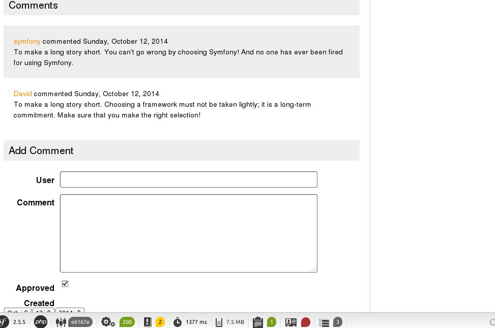

# Entity与Form

## 更新首页
在上一章中我们完成了文章展示页面。对于博客而言它的首页通常是显示最近的几篇文章的摘要信息。现在我们开始建立首页的内容。

更新控制器`PageController`：

```php
    public function indexAction()
    {
        $em = $this->getDoctrine()->getManager();

        $blogs = $em->createQueryBuilder()
                    ->select('b')
                    ->from('BloggerBlogBundle:Blog', 'b')
                    ->addOrderBy('b.created', 'DESC')
                    ->getQuery()
                    ->getResult();

        return array('blogs' => $blogs);
    }
```

更新模板`src/Blogger/BlogBundle/Resources/views/Page/index.html.twig`：

```html



    
        <article class="blog">
            <div class="date"><time datetime="{{ blog.created|date('c') }}">{{ blog.created|date('l, F j, Y') }}</time></div>
            <header>
                <h2><a href="{{ path('blogger_blogBundle_blog_show', { 'id': blog.id }) }}">{{ blog.title }}</a></h2>
            </header>

            
            <div class="snippet">
                <p>{{ blog.blog(500) }}</p>
                <p class="continue"><a href="{{ path('blogger_blogBundle_blog_show', { 'id': blog.id }) }}">Continue reading...</a></p>
            </div>

            <footer class="meta">
                <p>Comments: -</p>
                <p>Posted by <span class="highlight">{{blog.author}}</span> at {{ blog.created|date('h:iA') }}</p>
                <p>Tags: <span class="highlight">{{ blog.tags }}</span></p>
            </footer>
        </article>
    
        <p>There are no blog entries for symblog</p>
    

```

现在访问首页看下效果。


为了方便，我们为`Blog`实体创建一个订制一个查询方法`getLatestBlogs`。编辑文件`src/Blogger/BlogBundle/Entity/BlogRepository.php`，将上面`PageController`中的代码移动到这里来：

```php
class BlogRepository extends EntityRepository
{
    /**
     * @param integer $limit
     *
     * @return array
     */
    public function getLatestBlogs($limit = null)
    {
        $qb = $this->createQueryBuilder('b')
                   ->select('b')
                   ->addOrderBy('b.created', 'DESC');

        if (!empty($limit)) {
            $qb->setMaxResults($limit);
        }

        return $qb->getQuery()
                  ->getResult();
    }
}
```

然后在控制器中只需要调用即可：

```php
$blogs = $em->getRepository('BloggerBlogBundle:Blog')->getLatestBlogs();
```

## 创建评论
在上一章中我们已经创建了评论实体`Comment`，它记录了用户对于文章的评论内容。接下来我们将创建发布评论的页面。

### 添加测试数据
同样的为了测试方便，我们再添加一些评论的测试数据。新建文件`src/Blogger/BlogBundle/DataFixtures/ORM/CommentFixtures.php`，然后再重新加载数据。

```
$ php app/console doctrine:fixtures:load
```

### 显示评论
我们现在可以在第篇文章的展示页面显示它的评论内容。先更新`CommentRepository`，订制一个查询方法`getCommentsForBlog`：

```php
    public function getCommentsForBlog($blogId, $approved = true)
    {
        $qb = $this->createQueryBuilder('c')
                   ->select('c')
                   ->where('c.blog = :blog_id')
                   ->addOrderBy('c.created')
                   ->setParameter('blog_id', $blogId);

        if (false === is_null($approved)) {
            $qb->andWhere('c.approved = :approved')->setParameter('approved', $approved);
        }

        return $qb->getQuery()->getResult();
    }
```

接着更新`BlogController`，在展示页面查询文章对应的评论内容。

```php
    public function showAction($id)
    {
        $em = $this->getDoctrine()->getEntityManager();

        $blog = $em->getRepository('BloggerBlogBundle:Blog')->find($id);

        if (!$blog) {
            throw $this->createNotFoundException('Unable to find Blog post.');
        }

        $comments = $em->getRepository('BloggerBlogBundle:Comment')
                       ->getCommentsForBlog($blog->getId());

        return array('blog' => $blog, 'comments' => $comments);
    }
```

然后更新模板将评论数据进行渲染，`src/Blogger/BlogBundle/Resources/views/Blog/show.html.twig`：

```html

    {# .. #}
    <section class="comments" id="comments">
        <section class="previous-comments">
            <h3>Comments</h3>
            
        </section>
    </section>

```

这里我们通过`include`标签引用了另一个模板`BloggerBlogBundle:Comment:index.html.twig`，因此还需要再创建文件`src/Blogger/BlogBundle/Resources/views/Comment/index.html.twig`：

```html

    <article class="comment {{ cycle(['odd', 'even'], loop.index0) }}" id="comment-{{ comment.id }}">
        <header>
            <p><span class="highlight">{{ comment.user }}</span> commented <time datetime="{{ comment.created|date('c') }}">{{ comment.created|date('l, F j, Y') }}</time></p>
        </header>
        <p>{{ comment.comment }}</p>
    </article>

    <p>There are no comments for this post. Be the first to comment...</p>

```

现在打开一篇有评论的页面应该可以看到类似如下的效果：


### 创建评论表单
接下来将介绍本章的主要内容，表单（Form）与实体（Entity）关联。

现在我们来创建一个评论框表单，用户提交表单之后会创建一个实体对象，即就是往数据库中插入一条数据。

先为`Comment`实体创建一个表单类型`CommentType`。

```
$ php app/console generate:doctrine:form BloggerBlogBundle:Comment
```

上面这条命令将会新建一个文件： `src/Blogger/BlogBundle/Form/CommentType.php`，其内容与之前的`EnquiryType`类似。

### 显示评论表单
添加一条路由规则：

```yml
blogger_blogBundle_comment_create:
    pattern:  /comment/{blog_id}
    defaults: { _controller: BloggerBlogBundle:Comment:create }
    requirements:
        _method:  POST
        blog_id: \d+
```


创建一个新的控制器：

```
$ php app/console generate:controller --controller=BloggerBlogBundle:Comment --route-format=yml
```

完善控制器内容：

```php
class CommentController extends Controller
{
    /**
     * @param integer $blogId
     *
     * @return Response
     */
    public function newAction($blogId)
    {
        $blog = $this->getBlog($blogId);

        $comment = new Comment();
        $comment->setBlog($blog);
        $form   = $this->createForm(new CommentType(), $comment);

        return $this->render('BloggerBlogBundle:Comment:form.html.twig', array(
            'comment' => $comment,
            'form'   => $form->createView()
        ));
    }

    /**
     * @param integer $blogId
     *
     * @return Response
     */
    public function createAction($blogId)
    {
        $blog = $this->getBlog($blogId);

        $comment  = new Comment();
        $comment->setBlog($blog);
        $request = $this->getRequest();
        $form    = $this->createForm(new CommentType(), $comment);
        $form->bindRequest($request);

        if ($form->isValid()) {
            // TODO: Persist the comment entity

            return $this->redirect($this->generateUrl('blogger_blogBundle_blog_show', array(
                'id' => $comment->getBlog()->getId())) .
                '#comment-' . $comment->getId()
            );
        }

        return $this->render('BloggerBlogBundle:Comment:create.html.twig', array(
            'comment' => $comment,
            'form'    => $form->createView()
        ));
    }

    protected function getBlog($blogId)
    {
        $em = $this->getDoctrine()
                    ->getEntityManager();

        $blog = $em->getRepository('BloggerBlogBundle:Blog')->find($blogId);

        if (!$blog) {
            throw $this->createNotFoundException('Unable to find Blog post.');
        }

        return $blog;
    }
}
```

其中`newAction`是用于显示评论框表单的；`createAction`是用来处理表单提交的内容。

更新模板。新建`newAction`使用的模板文件`src/Blogger/BlogBundle/Resources/views/Comment/form.html.twig`：

```html
{# src/Blogger/BlogBundle/Resources/views/Comment/form.html.twig #}

<form action="{{ path('BloggerBlogBundle_comment_create', { 'blog_id' : comment.blog.id } ) }}" method="post" {{ form_enctype(form) }} class="blogger">
    {{ form_widget(form) }}
    <p>
        <input type="submit" value="Submit">
    </p>
</form>
```

新建`createAction`使用的模板文件`src/Blogger/BlogBundle/Resources/views/Comment/create.html.twig`：

```html


Add Comment


    <h1>Add comment for blog post "{{ comment.blog.title }}"</h1>
    

```

接着修改文章展示页面的模板，加入评论框表单：

```html

    {# .. #}
    <section class="comments" id="comments">
        {# .. #}
        <h3>Add Comment</h3>
        
    </section>

```

这里再打开文章页面看下效果。如果页面报错并提示：`Entities passed to the choice field must have a “__toString()” method defined`。

那么编辑`Blog`实体类，加入`__toString`方法：

```php
public function __toString()
{
    return $this->getTitle();
}
```

现在应该就能看到如下的效果：


用户在提交评论时应该只需要输入User和Comment，因此我们再对`CommentType.php`稍作修改移除多余字段。

```php
    public function buildForm(FormBuilderInterface $builder, array $options)
    {
        $builder
            ->add('user')
            ->add('comment');
    }
```

### 存入数据库
在上面创建表单对象时，`$form`已经与`$comment`进行关联了。因此在表单处理提交的数据时就已经将数据内容写入了`$comment`对象中。现在只需要将`$comment`的数据存入数据库就行了。

保存数据库的方法在之前的`DataFixtures`中已经提到了。现在更新`CommentController`的`create` 方法來儲存 `Comment`实体到数据库中。

```php
    if ($form->isValid()) {
        $em = $this->getDoctrine()
                   ->getEntityManager();
        $em->persist($comment);
        $em->flush();

        return $this->redirect($this->generateUrl('blogger_blogBundle_blog_show', array(
            'id' => $comment->getBlog()->getId())) .
            '#comment-' . $comment->getId()
        );
    }
```

## 表单验证

我們不希望用户提交的评论中`user`或`comment`为空。要处理这个问题可以参考之前的`EnquiryType`表单。

编辑文件`src/Blogger/BlogBundle/Entity/Comment.php`的`Comment`实体，添加如下内容：

```php
    public static function loadValidatorMetadata(ClassMetadata $metadata)
    {
        $metadata->addPropertyConstraint('user', new NotBlank(array(
            'message' => 'You must enter your name'
        )));
        $metadata->addPropertyConstraint('comment', new NotBlank(array(
            'message' => 'You must enter a comment'
        )));
    }
```

这样就可以防止用户提交空数据了。


